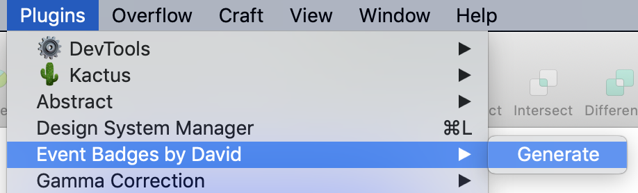

<h1 align="center">Event Badges by David</h1>
 

[Logo]

 

<strong max-width="600">This is a Sketch plugin that makes your life easier to make large quantity of name tags for any kind of events.</strong>

 
 

## Usage
1.Freely design your name tag in any size in Sketch. 
2.Select a layer where participant's name would fit. And name its layer to _name_. 
  
3.Execute Plugins → Event Badges by David → Generate 
  
4.Select the column of names from your spreadsheet and paste into the pop up window. 
  
5.Done! (Select all artboards and export as PDF.)

 

## Features
- It _copies_ an initial name tag you designed _as many as the number of participants_.
  - You can copy and paste an array of names from any spreadsheet software.
- It places the right number of name tags into _A4 size_ artboards (usually 2-3) to work with any printer.
  - Choosing other paper size options is not available yet. (ie. Letter)
- It generates _vertical lines_ in subtle grey along the edges of name tags for you to cut easily.

 

## Documentation
- Beta Release (v0.6): Coming soon
- [The First Attempt](https://medium.com/@designforhuman/designing-for-large-scale-handling-repetitions-with-code-in-sketch-85ef3efa868a)

 

## installation
1. Download the latest release of the plugin
2. Un-zip
3. Double-click on event-badges-by-david.sketchplugin

 

## Contributing
- You are very welcome to contribute to this project.
  - ⇄ Pull requests and ★ Stars are always welcome.
- You can also send me an email if you are not familiar with Git.
  - designforhuman@gmail.com

 

## License
[MIT](https://github.com/designforhuman/event-badges-by-david/blob/master/LICENSE)
